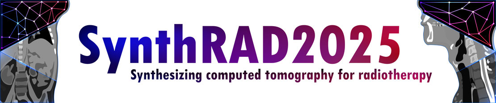

<!-- PROJECT LOGO -->
<br />
<p align="center">
  <a href="https://synthrad2025.grand-challenge.org/">
    
  </a>


  <p align="center">
    Data preprocessing step for the
<a href="https://synthrad2025.grand-challenge.org/"><strong>SynthRAD2025 Grand Challenge</strong></a>
  <br />
    <a href="https://github.com/SynthRAD2025/preprocessing"><strong>Explore the docs »</strong></a>
    <br />
    <br />
    <a href="https://github.com/SynthRAD2025/preprocessing">View Demo</a>
    ·
    <a href="https://github.com/SynthRAD2025/preprocessing/issues">Report Bug</a>
    ·
    <a href="https://github.com/SynthRAD2025/preprocessing/issues">Request Feature</a>
  </p>
</p>

# SynthRAD2025 pre-processing
This repository contains the code for pre-processing the data for the [SynthRAD2025 challenge](https://synthrad2025.grand-challenge.org/). The data preprocessing is performed in two stages:
1. **Stage 1** contains all pre-processing steps carried out locally in each data providing center. This includes the following steps:
    - **Data conversion**: All image data is converted to .nii.gz and .nrrd format.
    - **Rigid registration**: CBCT and MR images are registered to the corresponding CT images.
    - **Defacing**: Datasets with visible faces in the images are defaced.
    - **Resampling**: Images are resampled to a common voxel size.

2. **Stage 2** contains all steps that are carried out for the entire dataset at once and includes the following steps:
    - **Deformable image registration**: MR/CBCT images are deformably registered to the CT
     - **Cropping**: CBCT/CT/MR and structures are cropped to the same size.
     - **Validation**: The preprocessed data is validated to ensure that the preprocessing steps have been carried out correctly.
     - **Dataset creation**: The preprocessed data is seperated into training/validation and test datasets. Furthermore separate datasets for centers and tasks are created.

# Requirements

The code is written/tested in Python 3.12.3 The following packages are required to run the code:

- SimpleITK-SimpleElastix
- numpy
- nibabel
- scipy
- totalsegmentator
- matplotlib
- csv

For Dicom tag extraction the following packages are required:
- pydicom 
- openpyxl

To convert RT structs to .nrrd files plastimatch is required. Plastimatch can be downloaded from [here](https://plastimatch.org/). The path to plastimatch should be added to the system path.

# Usage

The code is organized in two main files: [stage1.py](./stage1.py) and [stage2.py](./stage2.py). The code for stage 1 can be run by executing the following command:

```python stage1.py config.csv```

## Stage 1 

### Inputs

[stage1_config.csv](./stage1_config.csv) is a configuration file that contains the paths to the input data and the parameters for the preprocessing steps. The configuration file contains a header in the first row each further row contains configuration for a single patient. The configuration file should contain the following columns:

| column        | description           | parsed as|
| ------------- |-------------| -------|
| **ID**        | A unique patient ID in the synhtRAD2025 format: [Task][Region][Center][001-999].| str |
| **task**      | *1* for Task 1 (MR-to-CT) and *2* for Task 2 (CBCT-to-CT)      |int|
| **region**    |  *HN* for head and neck, *AB* for abdomen, *TH* for thorax  |  string |
| **ct_path**   | path to CT image, can be a dicom directory or a single file compatible with SimpleITK (e.g .mha, .nrrd, .nii.gz, ...) | string |
| **input_path**| path to MR/CBCT image, can be a dicom directory or a single file compatible with SimpleITK (e.g .mha, .nrrd, .nii.gz, ...) | string |
| **struct_path**| path to RTstruct file, can be left empty if no structure file is available| string |
| **output_dir**| path to output directory, if directory does not exist it will be generated| string |
| **defacing**| *True* if defacing is required, *False* otherwise| bool |
| **registration**| path to registration parameter file, registration files are provided in [configs](./configs/)| bool |
| **reg_fovmask**| *True* if a FOV mask should be used for registration, *False* otherwise| bool |
| **background**| intensity of background, usually 0 for MR and -1024 for CBCT, but can vary between centers/regions and can influence FOV masking| float |
| **order**| order of axis, usually should be [Sagittal, Coronal, Axial], if reordering is required indicate order using following notation: e.g. [2,1,0] reverses the order | array |
| **flip**| flip an axis, usually should be [False, False, False], if flipping is required indicate flip using following notation: e.g. [True, False, False] flips the first axis | array |
| **resample**| resamples to a uniform voxel size, indicate the target voxel size with array, e.g. [1,1,3] results in in-plane voxel size of 1mm x 1mm and slice thickness of 3 mm | array |
| **mr_overlap_correction**| *True* if MR overlap correction (some centers have artificial override to match multiple scans) is required, *False* otherwise| bool |
| **intensity_shift**| shifts the intensity of an image, usually 0, but can be required for CBCTs| float |

### Outputs

stage1.py generates the following outputs for each patient:

- **ct_s1.nii.gz**: defaced (if HN) and resampled CT image
- **mr_s1.nii.gz**: defaced (if HN), resampled and registered MR image (only for task 1 cases)
- **cbct_s1.nii.gz**: defaced (if HN), resampled and registered CBCT image (only for task 2 cases)
- **fov_s1.nii.gz**: FOV mask of input image (CBCT/MR) in CT frame of reference
- **defacing_mask.nii.gz**: mask of defaced region
- **transform.tfm**: transformation file from input image to CT frame of reference
- **overview.png**: overview image of the CT and input images (CBCT/MR)

### Troubleshooting

#### Registration
In case the registration fails, the following steps can be taken:
- If the script crashes during registration, try changing the registration parameter file and use a parameter file with more or less sampling points (indicated by the number in the filename).
- If the script does not crash, but images are not registered correctly, try changing the registration parameter file. If you are currently using `param_rigid_small_*.txt`, try using a `param_rigid_large_*.txt` parameter file (or the other way around).


## Stage 2

### Inputs
[stage2_config.csv](./stage2_config.csv) is a configuration file that contains all input parameters for the second stage. The configuration file contains a header in the first row and each further row contains configuration parameters for a single patient. The configuration file must contain the following columns:

| column        | description           | parsed as|
| ------------- |-----------------------| ---------|
| **ID**        | A unique patient ID in the synhtRAD2025 format: [Task][Region][Center][001-999].| str |
| **task**      | *1* for Task 1 (MR-to-CT) and *2* for Task 2 (CBCT-to-CT)      |int|
| **region**    |  *HN* for head and neck, *AB* for abdomen, *TH* for thorax  |  string |
| **output_dir**   | directory containing outputs from stage1 and where all generated data from stage 1 will be stored | string |
| **mask_thresh**| threshold for masking patient outline, value between 0 and 1, see stage2_config.csv for examples| float |
|**defacing_correction**| *True* if defacing correction is required, *False* otherwis, ensures that all masks and images are defaced correctly| bool |
|**cone_correction**| *True* if cone correction is required, *False* otherwise, ensures that all masks and images are corrected for cone beam artifacts at FOV edge, used only in Task2 | bool |
|**IS_correction**| *True* if inferior-superuior FOV corrections are required, *False* otherwise, used mainly for 1B data | bool |
|**parameter_def**| path to parameter file for deformable registration, example registration files are provided in [configs](./configs/)| string |
|**invert_structures**| if structures are delineated on the MR frame of reference instead of CT set to true| bool |

### Outputs
stage2.py generates the following outputs for each patient:
- **ct_s2.nii.gz**: resampled and cropped CT image
- **mr_s2.nii.gz**: resampled, registered and cropped MR image (only for task 1 cases)
- **cbct_s2.nii.gz**: resampled, registered and cropped CBCT image (only for task 2 cases)
- **fov_s2.nii.gz**: FOV mask of input image (CBCT/MR) in CT frame of reference
- **transform_def.txt**: transformation file from input image to CT frame of reference
- **ID_s2.png**: overview image of the CT, input images (CBCT/MR), mask and and overlay
- **ID_planning_s2.nrrd**: overview image showing also the deformed CT, planning structures and overlays for the deformed image

## Dicom tag extraction

**read_tags(input_txt)**

	description:
	read dicom tag strings from a txt file

	arguments:
	input_txt: file path to text file containg dicom tags (see example in param_files)
	
	returns: 
	python list containing dicom tags

**extract_tags(dcm_folder_path,tag_list,pre_processed=None)**

	description:
	extracts tags from a folder containg dicom files (only from the first element) and from pre-processed nifti images

	arguments:
	dcm_folder_path: path to folder containing dicom image slices
	tag_list: list defining which tags to extract
	pre_processed: path to pre-processed nifti file (can be left out if tags should be only extracted from dicom files)

	returns:
	python dict with dicom tags as key:value pairs

**write_dict_to_csv(input_dict,output_csv,tag_list)**

	description:
	takes a dict containing dicom tags and writes it to a csv file

	arguments:
	input_dict: dict containing extracted tags
	output_csv: filename of output csv file
	tag_list: list of dicom tags, necessary to create header in csv file

**write_csv_to_xlsx(input_csv,output_xlsx)**

	description:
	takes a csv and creates an xlsx file

	arguments:
	input_csv: path to csv file
	output_xlsx: filepath of output xlsx file
